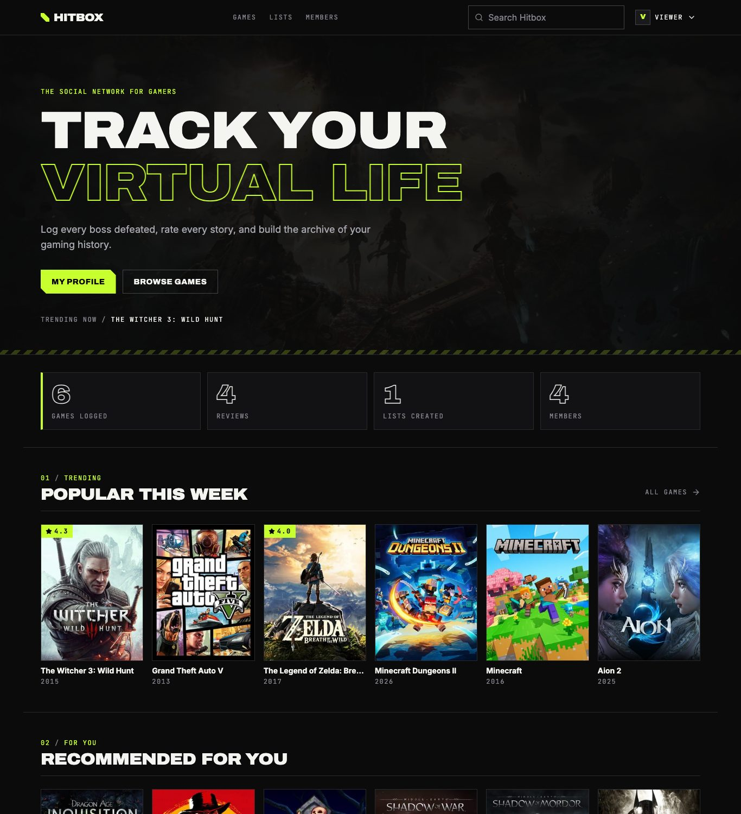
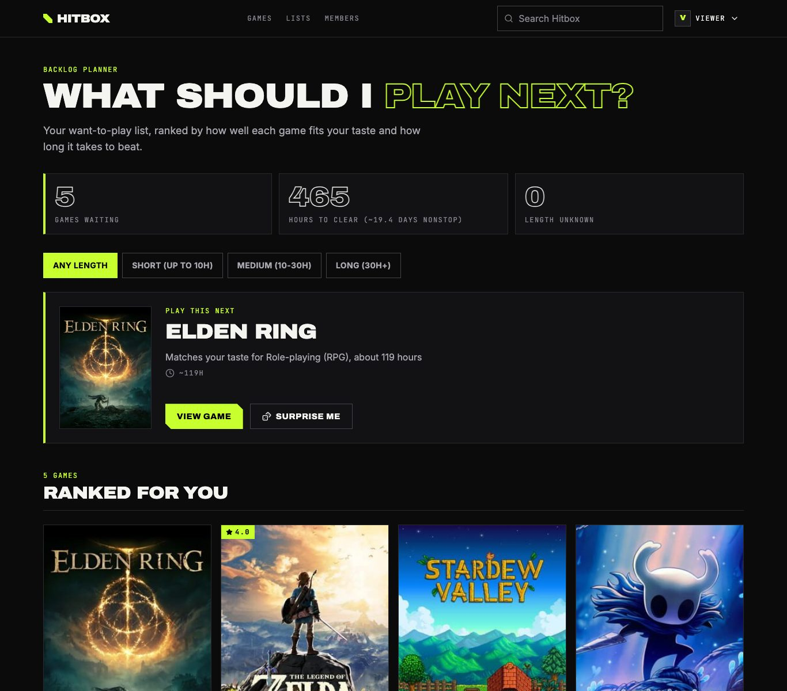
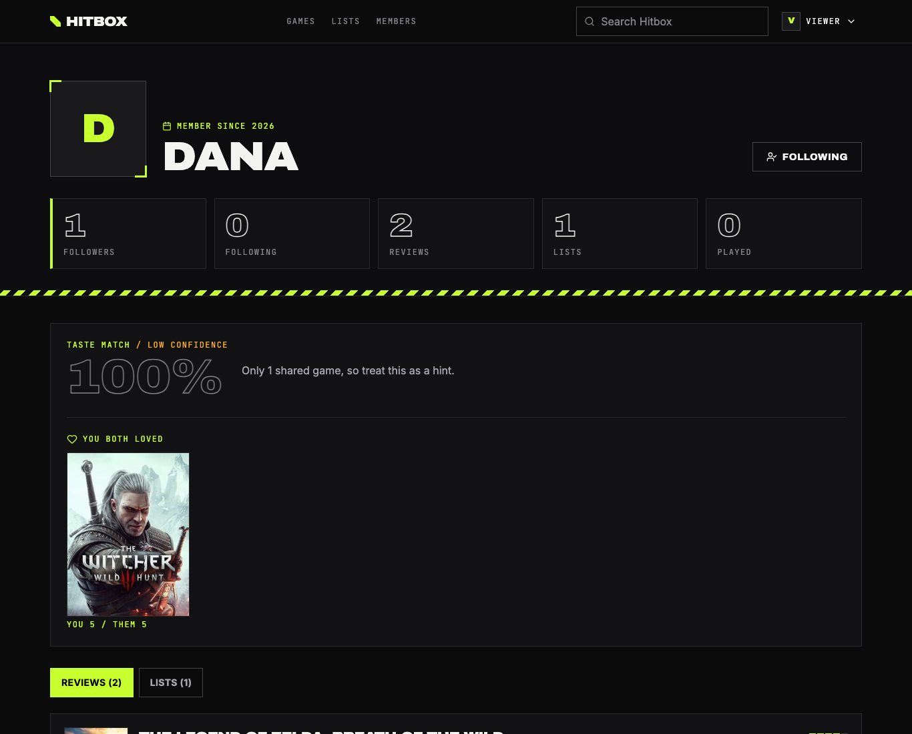
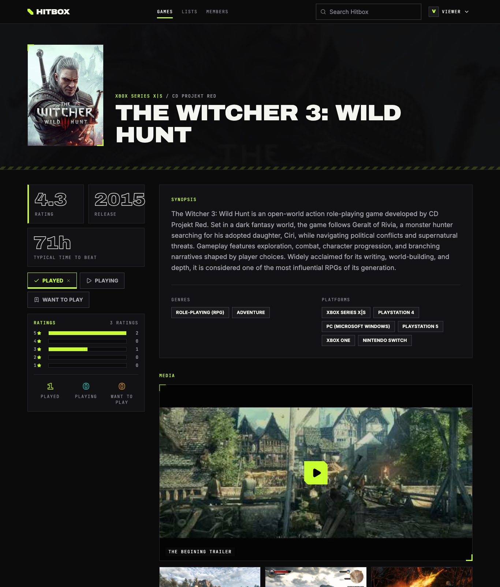
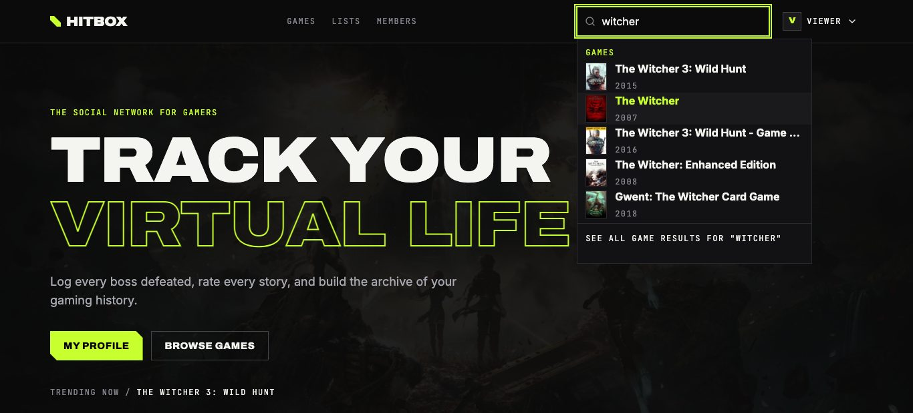
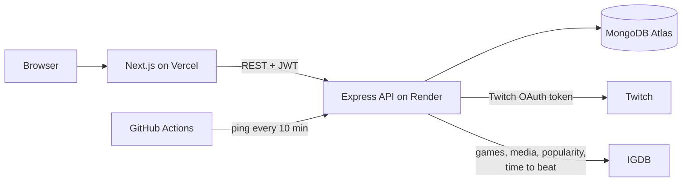

# Hitbox

**Track, review and share the games you play, then let Hitbox tell you what to play next.**

A full-stack social app for gamers in the spirit of Letterboxd and Backloggd, with a backlog planner that ranks your want-to-play list by how well each game fits your taste and how long it takes to beat.

**[Live site](https://hitbox-6d3o.vercel.app)** · **[API health](https://hitbox-b83d.onrender.com/health)**

> The API runs on a free tier that sleeps when quiet. The first request after a quiet spell can take up to a minute; the site tells you when that is happening, and a scheduled ping keeps it awake most of the time.



## What makes it different

### What should I play next?
Mark games as *Want to play* and the backlog planner ranks them by how well each fits the genres you rate highly and how members rate it, using real time-to-beat data from IGDB. It shows how many hours your backlog adds up to, filters by length, and has a *Surprise me* button. Every pick says why it was chosen.



### Taste match
Open any member's profile to see how alike your ratings are: a match percentage, the games you both loved, and the games you disagree on. It is honest about small samples: a match based on one shared game is dimmed and labelled low confidence.



## Features

- **Discover**: browse and search 500K+ games from IGDB with filters and sorting that live in the URL; *Popular this week* blends IGDB's visit popularity with Hitbox's own activity; instant search across games, members and lists.
- **Game pages**: ratings histogram, played/playing/want-to-play counts, trailer, screenshot gallery, similar games, typical time to beat, and "members who liked this also liked".
- **Review and track**: 1-5 star reviews with a spoiler toggle, likes, and statuses (played, playing, want to play).
- **Lists and comments**: curated lists with discussion threads.
- **Social**: follow members and get a feed of their reviews, lists and activity.
- **Recommended for you**: picks from similar members' ratings, your genre taste and IGDB's similar games, each with a plain-language reason.





## Architecture



- **Frontend**: Next.js 16 (App Router), React 19, Tailwind 4. Game, list and member pages render their titles and share previews on the server; the rest is client-side with a small data hook (`useApi`).
- **Backend**: Express 5 and Mongoose. Routes stay thin; logic lives in services, with the scoring (recommendations, backlog, taste match, trending) written as pure functions so it can be tested without a database. Every request is validated with zod.
- **IGDB**: games are fetched on demand and saved locally the first time anyone reviews, lists or tracks one. Screenshots, similar games and time to beat are cached on the game.

### Decisions worth reading
- [The feed is built on read, not stored](docs/decisions/0001-feed-built-on-read.md)
- [Recommendations are explainable heuristics, not machine learning](docs/decisions/0002-explainable-recommendations.md)
- ["Popular this week" blends two signals](docs/decisions/0003-trending-blends-igdb-and-hitbox.md)
- [A flat design system, and plain `` tags](docs/decisions/0004-flat-design-and-plain-img.md)
- [The backlog planner and taste match](docs/decisions/0005-backlog-and-taste-match.md)
- [Security notes and known gaps](docs/security.md)

## Quality

- **Backend**: 200+ tests (vitest and supertest), including integration tests against a real MongoDB with IGDB mocked.
- **Frontend**: component and hook tests (vitest and Testing Library); an automated axe scan found 0 WCAG 2.1 AA violations across the main pages, and no page scrolls sideways at 375px.
- **CI** (GitHub Actions) runs lint, formatting, tests and the build for both apps on every push.
- Validation on every route, rate limiting, security headers, structured logging, and a short list of [known gaps](docs/security.md).

## Tech stack

Next.js 16 · React 19 · Tailwind CSS 4 · Express 5 · MongoDB and Mongoose · zod · JWT and bcrypt · pino · helmet · IGDB (via Twitch OAuth) · Vitest · Testing Library · GitHub Actions · Vercel and Render.

## Run it locally

You need Node 20 or newer (22 recommended), a MongoDB (local or Atlas) and [Twitch developer credentials](https://dev.twitch.tv/console/apps) for IGDB.

```bash
git clone https://github.com/mayank-pillai-99/Hitbox.git
cd Hitbox

# Backend (port 8000)
cd backend
npm install
cp .env.example .env     # fill in the values; the server lists anything missing at startup
npm run dev

# Frontend (new terminal)
cd frontend
npm install
cp .env.example .env.local
npm run dev              # http://localhost:3000
```

Checks:

```bash
cd backend  && npm run lint && npm run format:check && npm test
# add the MongoDB integration tests (this wipes that database):
MONGO_TEST_URI=mongodb://127.0.0.1:27017/hitbox-test npm test

cd frontend && npm run lint && npm test && npm run build
```

## Project structure

```
backend/src
  config/       environment validation (zod), database connection
  lib/          logger, errors, IGDB client, IGDB-to-app mapper, regex helpers
  middleware/   auth, validation, rate limits, error handler
  models/       Mongoose schemas
  routes/       thin route handlers
  schemas/      zod schemas for every request
  services/     game caching, IGDB queries, scoring (recommend, backlog, taste match, trending), search, feed
frontend/src
  app/          pages (server wrappers for game, list and member pages)
  components/   domain components; components/ui holds the shared design-system pieces
  hooks/        useApi, useRequireAuth
  context/      auth and toasts
docs/           decisions (ADRs), security notes, screenshots
```

## API

Authenticated routes expect the JWT in an `x-auth-token` header. Errors are JSON: `{ "message": "..." }`.

### Auth
| Method | Endpoint | Description |
|--------|----------|-------------|
| POST | `/api/auth/register` | Register user |
| POST | `/api/auth/login` | Login user |
| POST | `/api/auth/logout` | Logout (the client discards its token) |
| GET | `/api/auth/me` | Get current user and stats |
| PUT | `/api/auth/me` | Update profile |

### Games
| Method | Endpoint | Description |
|--------|----------|-------------|
| GET | `/api/games` | Browse and search games (`search`, `ordering`, `genres`, `platforms`, `dates`, `page`) |
| GET | `/api/search?q=` | Search games, members and lists at once (5 each, cached 60 s) |
| GET | `/api/games/trending` | Popular this week: IGDB visit popularity blended with Hitbox's last 7 days of reviews and status changes (cached 15 minutes) |
| GET | `/api/games/:id` | Game details (local id or IGDB id) |
| GET | `/api/games/:id/extras` | Screenshots, trailers and similar games (cached) |
| GET | `/api/games/:id/also-liked` | Games loved by members who loved this one |
| GET | `/api/backlog` | Your want-to-play list ranked by fit and time to beat (`time=any|short|medium|long`) |
| GET | `/api/games/:id/stats` | Rating histogram, average and played/playing/want-to-play counts |

### Reviews
| Method | Endpoint | Description |
|--------|----------|-------------|
| GET | `/api/reviews/recent` | Latest reviews |
| GET | `/api/reviews/my` | Your reviews |
| GET | `/api/reviews/game/:id` | Get game reviews (`sort=recent|liked`) |
| POST | `/api/reviews` | Create review |
| PUT | `/api/reviews/:id` | Update review |
| DELETE | `/api/reviews/:id` | Delete review |
| POST | `/api/reviews/:id/like` | Like review |
| DELETE | `/api/reviews/:id/like` | Unlike review |

### Lists
| Method | Endpoint | Description |
|--------|----------|-------------|
| GET | `/api/lists/discover` | Browse lists (`q`, `sort=popular|recent`, `page`, `limit`) |
| GET | `/api/lists` | Your lists |
| GET | `/api/lists/:id` | List details |
| POST | `/api/lists` | Create list |
| PUT | `/api/lists/:id` | Update list |
| DELETE | `/api/lists/:id` | Delete list and its comments |
| POST | `/api/lists/:id/add` | Add a game |
| DELETE | `/api/lists/:id/game/:gameId` | Remove a game |

### Game status
| Method | Endpoint | Description |
|--------|----------|-------------|
| GET | `/api/game-status` | Your games grouped by status |
| GET | `/api/game-status/counts` | Counts per status |
| GET | `/api/game-status/game/:id` | Your status for one game |
| POST | `/api/game-status` | Set status (`played`, `playing`, `want_to_play`) |
| DELETE | `/api/game-status/:id` | Clear status |

### Comments
| Method | Endpoint | Description |
|--------|----------|-------------|
| GET | `/api/comments/list/:id` | Get list comments |
| POST | `/api/comments/list/:id` | Add comment |
| DELETE | `/api/comments/:id` | Delete comment |

### Users and stats
| Method | Endpoint | Description |
|--------|----------|-------------|
| GET | `/api/users` | Members directory (`q`, `sort`, `page`, `limit`) |
| GET | `/api/users/:username` | Public profile |
| GET | `/api/users/:username/reviews` | A member's reviews |
| GET | `/api/users/:username/lists` | A member's lists |
| POST | `/api/users/:username/follow` | Follow a member |
| DELETE | `/api/users/:username/follow` | Unfollow |
| GET | `/api/users/:username/followers` | A member's followers |
| GET | `/api/users/:username/following` | Who a member follows |
| GET | `/api/recommendations` | Personalised picks with reasons (popular games until you've rated something) |
| GET | `/api/users/:username/match` | Taste match with another member |
| GET | `/api/feed` | Activity feed from members you follow (`before`, `limit`) |
| GET | `/api/stats` | Site-wide counts |
| GET | `/health` | Liveness check |

## Credits

Game data and images from [IGDB](https://www.igdb.com). Visual direction inspired by [Marathon](https://marathonthegame.com).

Built by Mayank Pillai.
